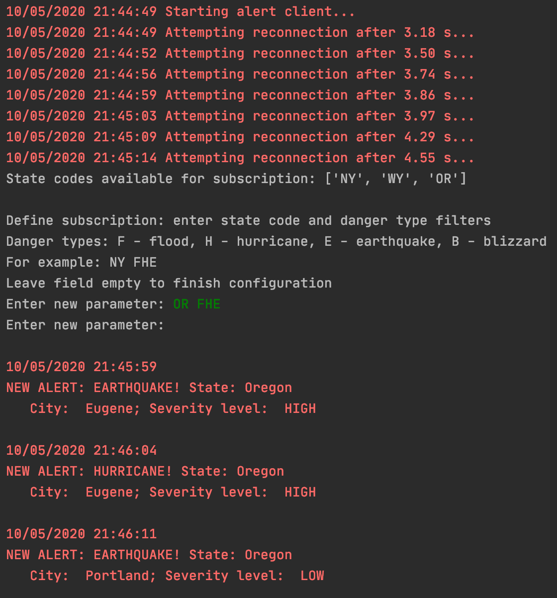
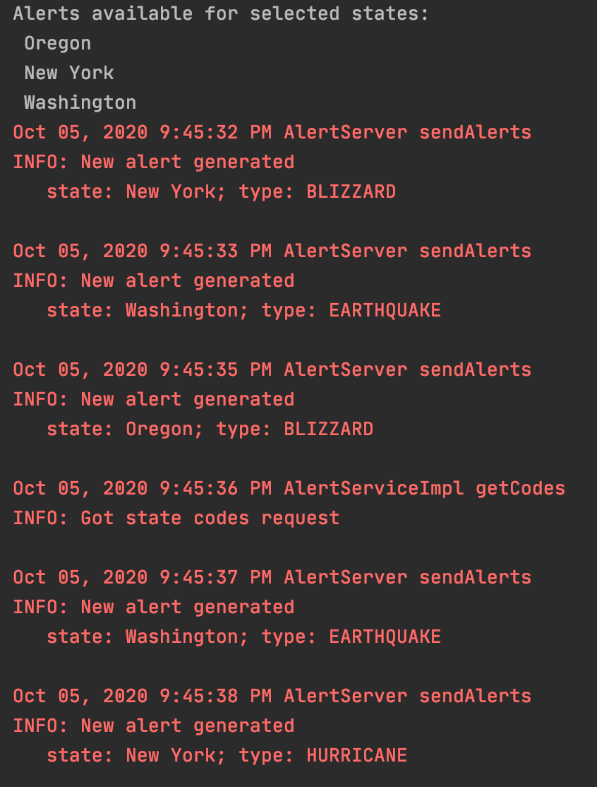

# Danger Alert service

Assignment from Distributed Systems course. Client can subscribe to selected alerts about natural disasters, generated by Server. Both client and server are fail-safe - loss of network connectivy on either side is properly handled.

Technologies: Java, Python, Protocol Buffers, gRPC.

### Client 
It can subscribe to selected alerts about natural disasters. Reconnects with exponential backoff in case of connection error.

### Server
Generates fake alerts about natural disasters and streams them to clients, according to their preferences.

